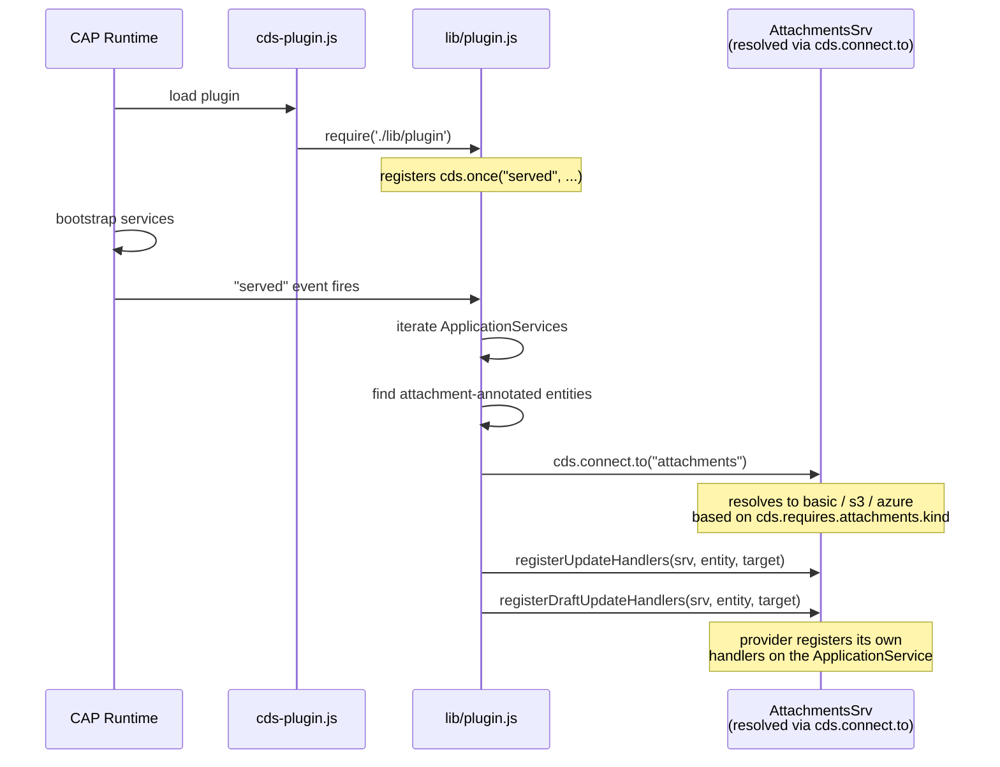
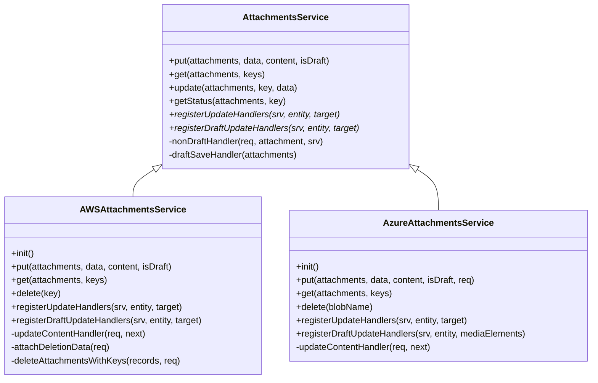
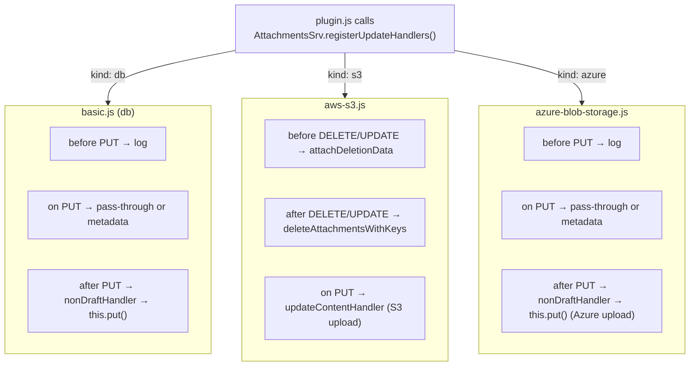
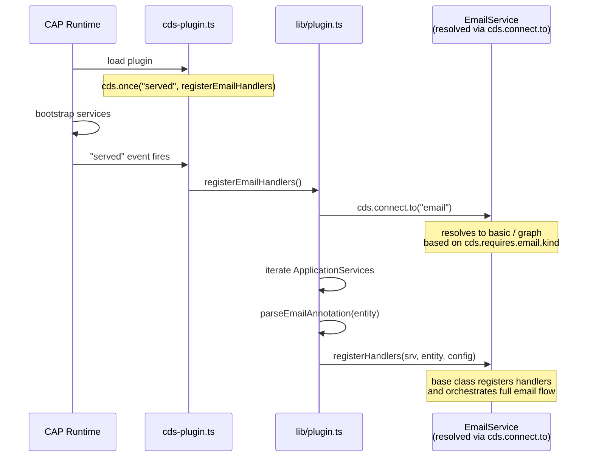
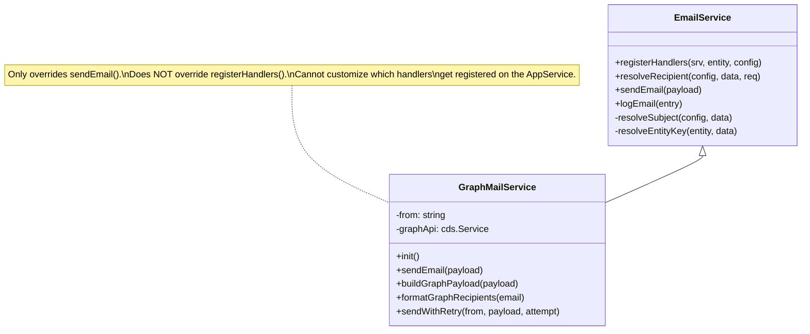
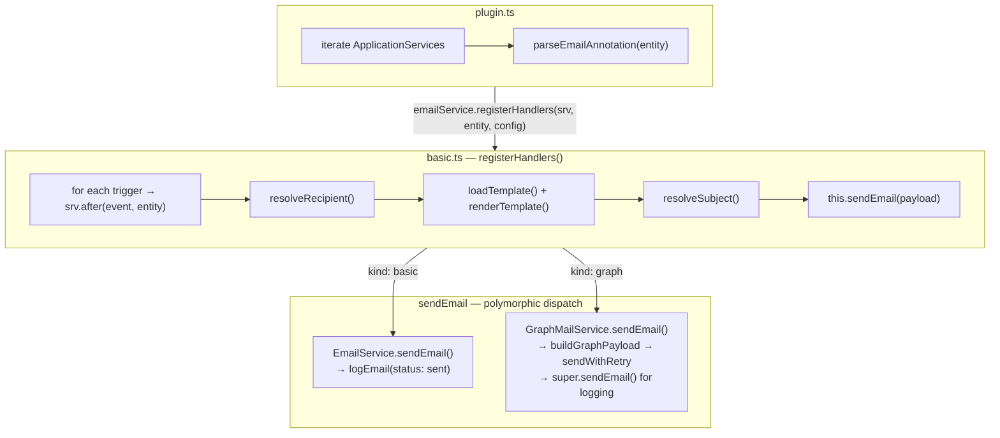
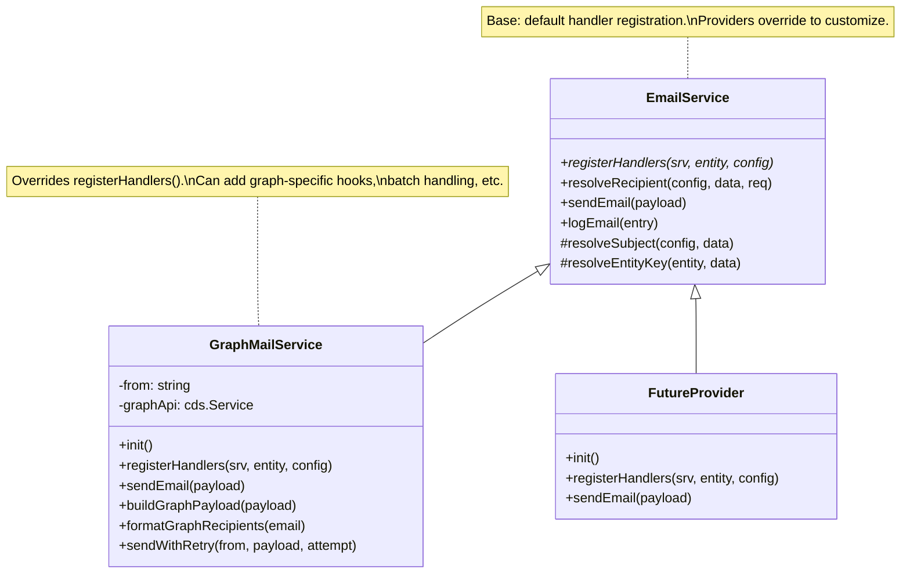
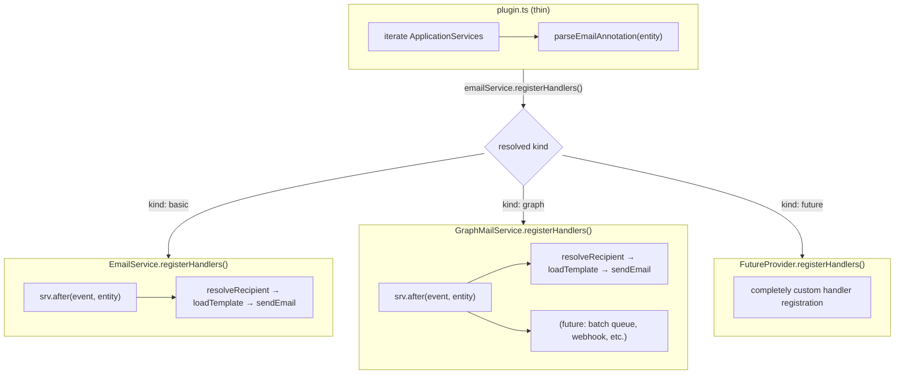

# Architecture Analysis: cap-email vs @cap-js/attachments

Comparison of the current cap-email plugin architecture against the @cap-js/attachments plugin pattern, with a focus on
handler registration and provider extensibility.

## @cap-js/attachments — Reference Architecture

### File Structure

```
cds-plugin.js          → Pure loader: require('./lib/plugin')
lib/plugin.js          → cds.once("served") — iterates services, delegates to AttachmentsSrv
lib/basic.js           → Base class (AttachmentsService extends cds.Service)
lib/aws-s3.js          → S3 provider (overrides registerUpdateHandlers + put/get/delete)
lib/azure-blob-storage → Azure provider (overrides registerUpdateHandlers + put/get/delete)
```

### Boot Sequence



### Handler Registration — Polymorphic Override

The critical pattern: **each provider overrides `registerUpdateHandlers()`** to register the exact handlers it needs on
the ApplicationService.



### What Each Provider Registers

The base class and each subclass register **completely different** handlers on the ApplicationService:



### Key Takeaway

The plugin never decides _how_ to handle events. It only decides _which entities_ need handlers. The resolved service
class controls everything: which events to listen to, what handlers to register, and how to process the data. This makes
providers fully independent.

---

## cap-email — Current Architecture

### File Structure

```
cds-plugin.ts          → cds.once("served", registerEmailHandlers)
lib/plugin.ts          → parseEmailAnnotation + registerEmailHandlers (delegates to service)
lib/basic.ts           → EmailService (base): registerHandlers + sendEmail + logEmail
lib/graph-mail.ts      → GraphMailService: overrides sendEmail() only
lib/types.ts           → Interfaces + annotation config
lib/constants.ts       → Shared constants
lib/template-engine.ts → Template loading + rendering
```

### Boot Sequence



### Current Class Hierarchy



### Current Handler Registration Flow



---

## Gap Analysis

| Concern                                     | @cap-js/attachments                                                    | cap-email (current)                                              |
| ------------------------------------------- | ---------------------------------------------------------------------- | ---------------------------------------------------------------- |
| Plugin entry point                          | Thin loader                                                            | Thin — `cds.once("served", fn)`                                  |
| Plugin logic                                | Iterates + delegates                                                   | Iterates + delegates (after refactor)                            |
| Base class registers handlers               | `registerUpdateHandlers()`                                             | `registerHandlers()`                                             |
| **Subclass overrides handler registration** | **Yes — S3 and Azure register completely different handlers**          | **No — GraphMailService does not override `registerHandlers()`** |
| Provider-specific behavior                  | Via overridden `registerUpdateHandlers()` + overridden `put()`/`get()` | Via overridden `sendEmail()` only                                |
| Provider controls which events to listen to | Yes                                                                    | No — base class decides for all providers                        |

### The Problem

Currently, `registerHandlers()` lives entirely on the base `EmailService`. Every provider gets the exact same handler
registration: `srv.after(event, entity)` → resolve recipient → load template → `this.sendEmail()`.

This means:

- A provider **cannot** register additional handlers (e.g., batch queue handler, webhook callback)
- A provider **cannot** change the orchestration flow (e.g., skip template rendering for API-driven emails)
- A provider **cannot** register different event hooks (e.g., `before` handlers for validation)
- All provider-specific behavior is funneled through a single `sendEmail()` override

In the attachments plugin, S3 registers deletion-tracking handlers that the base class doesn't have. Azure registers
draft-specific blob handlers. Each provider is fully autonomous in what it registers.

---

## Target Architecture

Apply the attachments pattern: **each provider overrides `registerHandlers()`** to control its own handler registration
on the ApplicationService.



### Target Handler Registration Flow



### What Changes

1. **`lib/graph-mail.ts`** — Override `registerHandlers()`. Initially calls `super.registerHandlers()` (same behavior),
   but now has the hook point for graph-specific customization.
2. **`lib/basic.ts`** — No change needed. Base `registerHandlers()` stays as the default.
3. **`lib/plugin.ts`** — No change needed. Already delegates to the resolved service.

This is a low-cost change that unlocks provider autonomy for future providers.
