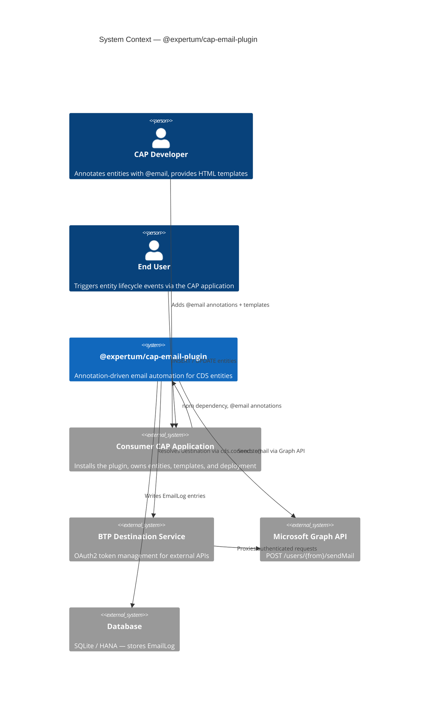
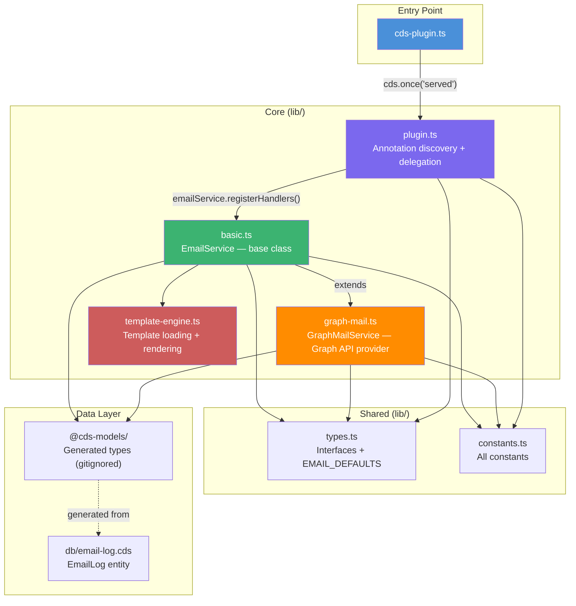
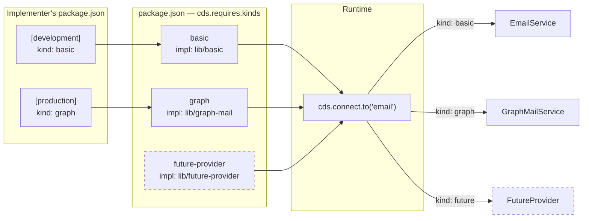
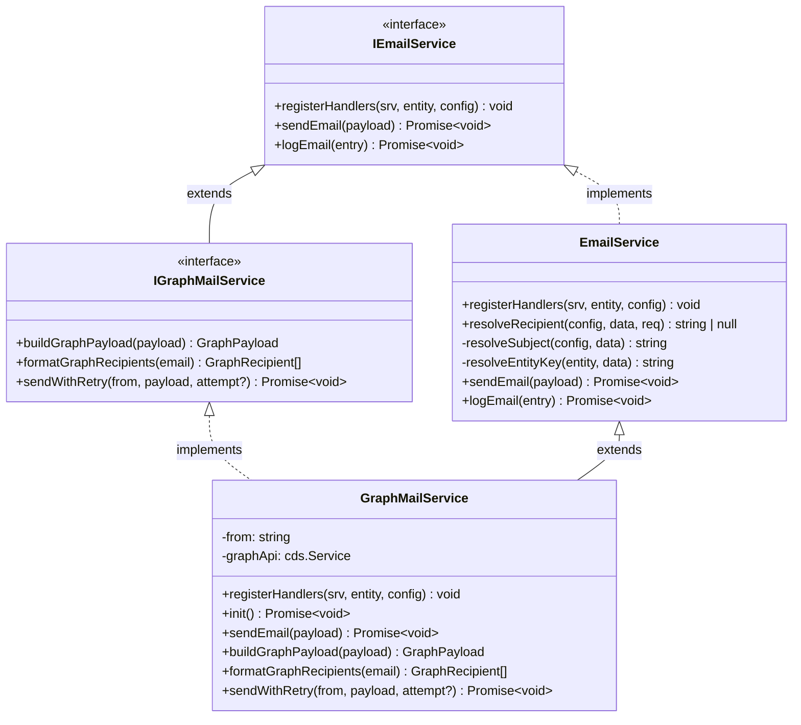
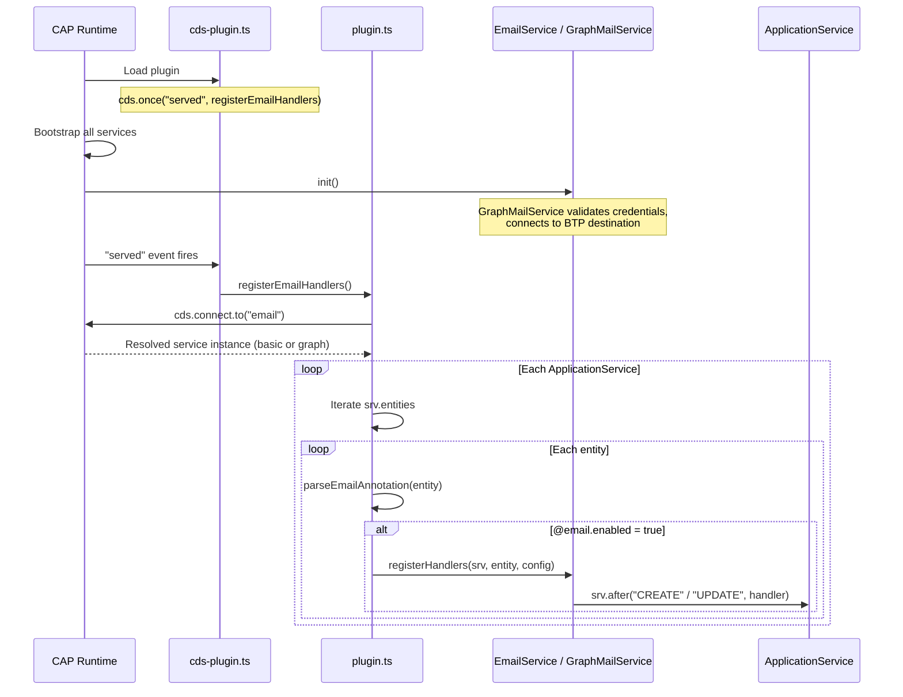
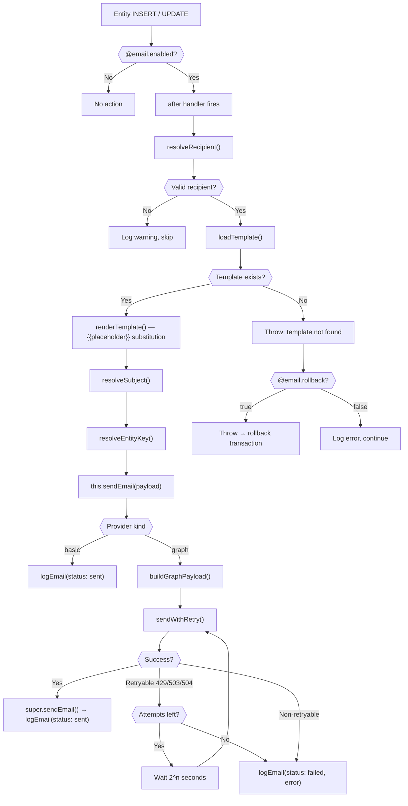
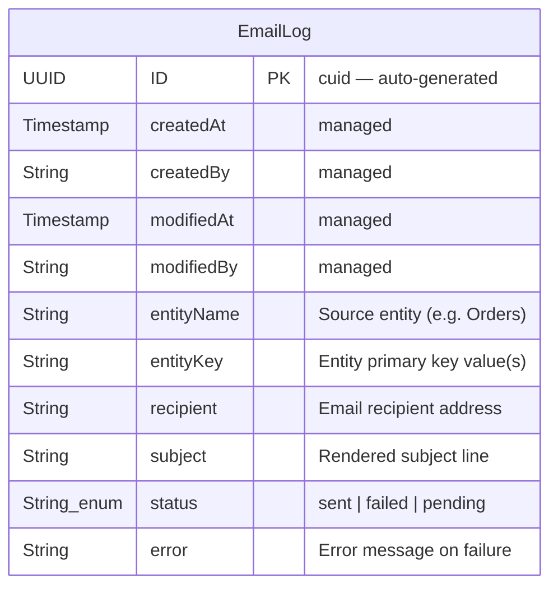
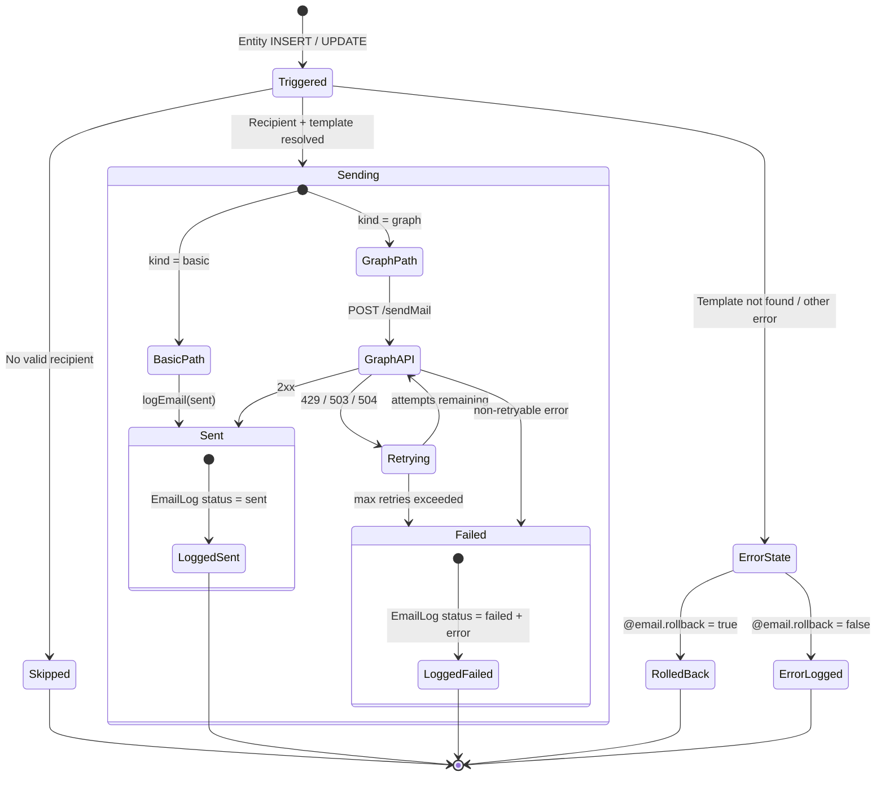

# Architecture Overview

`@expertum/cap-email-plugin` — annotation-driven email automation for SAP CAP entities.

## System Context

The plugin is installed as an npm dependency in a consumer CAP application. It has no opinion on database, deployment
target, or template files — those belong to the implementer.

## Plugin Internals

## Service Kind Resolution

CAP resolves the correct service class based on the implementer's `cds.requires.email.kind` configuration.

## Class Hierarchy

Follows the `@cap-js/attachments` base/subclass pattern: the base class provides default handler registration and shared
logic, subclasses override to add provider-specific behavior.

### Why subclasses override `registerHandlers()`

This follows the `@cap-js/attachments` pattern where S3 and Azure each override `registerUpdateHandlers()` to register
completely different event hooks on the ApplicationService. Each provider controls:

- **Which events** to listen to (e.g., a batch provider might skip per-entity handlers entirely)
- **What orchestration** to perform (e.g., skip template rendering for API-driven emails)
- **What additional hooks** to register (e.g., `before` handlers for validation, webhook callbacks)

The base class provides a sensible default. Subclasses override when they need different behavior.

## Boot Sequence

## Email Dispatch Flow

The full flow from entity event to email delivery and logging.

## Data Model

The plugin owns a single entity for email delivery tracking.

The relationship to consumer entities is intentionally **logical** (via `entityName` + `entityKey` strings) rather than
a CDS composition. The plugin doesn't know the consumer's entities at design time.

## Email Status Lifecycle

## Annotation Defaults

All `@email` properties have sensible defaults. `@email.enabled: true` is the only required annotation.

| Property          | Default        | Description                                                    |
| ----------------- | -------------- | -------------------------------------------------------------- |
| `enabled`         | `false`        | Activate email automation for this entity                      |
| `template`        | `{EntityName}` | Template file name (resolved to `email-templates/{name}.html`) |
| `trigger`         | `["INSERT"]`   | Lifecycle events: `INSERT`, `UPDATE`                           |
| `condition`       | `undefined`    | Expression to evaluate before sending (not yet implemented)    |
| `toField`         | `undefined`    | Entity field containing the recipient email                    |
| `subject`         | `undefined`    | Subject line with `{{placeholder}}` support                    |
| `rollback`        | `false`        | Rollback transaction on email failure                          |
| `saveToSentItems` | `true`         | Save to sender's Sent Items (Graph provider)                   |

## File Reference

| File                     | Responsibility                                                                                                     |
| ------------------------ | ------------------------------------------------------------------------------------------------------------------ |
| `cds-plugin.ts`          | Entry point — `cds.once("served", registerEmailHandlers)`                                                          |
| `lib/plugin.ts`          | Annotation discovery (`parseEmailAnnotation`) + delegation                                                         |
| `lib/basic.ts`           | `EmailService` — base class with handler registration, recipient resolution, template orchestration, email logging |
| `lib/graph-mail.ts`      | `GraphMailService` — Microsoft Graph provider with retry logic                                                     |
| `lib/template-engine.ts` | Template loading from implementer's `email-templates/` directory + `{{placeholder}}` rendering                     |
| `lib/types.ts`           | All interfaces (`IEmailService`, `IGraphMailService`, `EmailPayload`, etc.) + `EMAIL_DEFAULTS`                     |
| `lib/constants.ts`       | All constants (annotation prefix, patterns, retry config, trigger-to-event mapping)                                |
| `db/email-log.cds`       | Plugin-owned `EmailLog` entity definition                                                                          |
