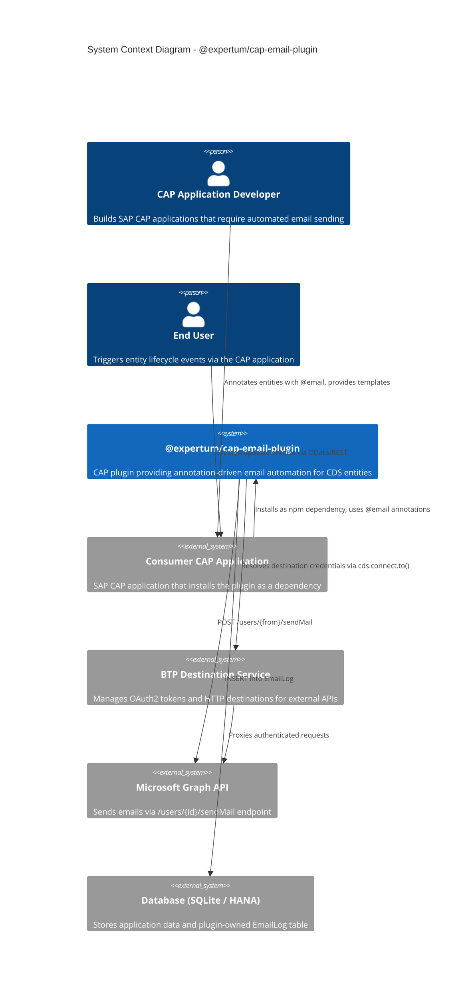
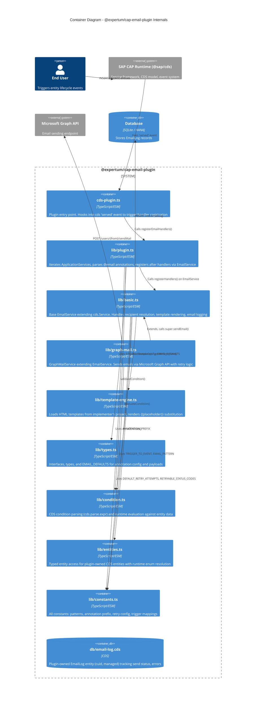
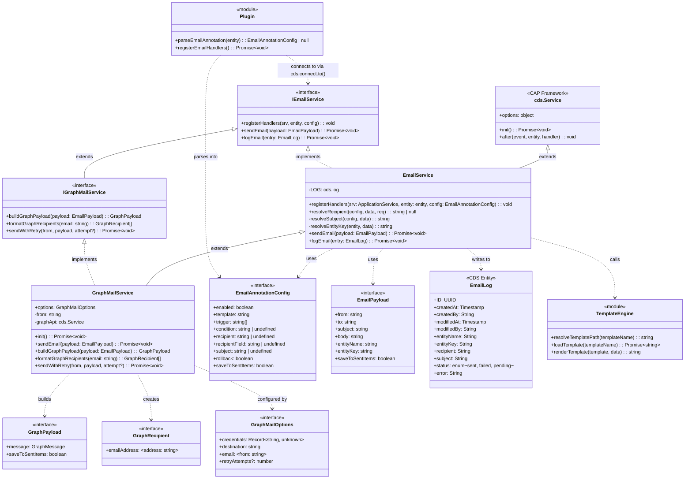
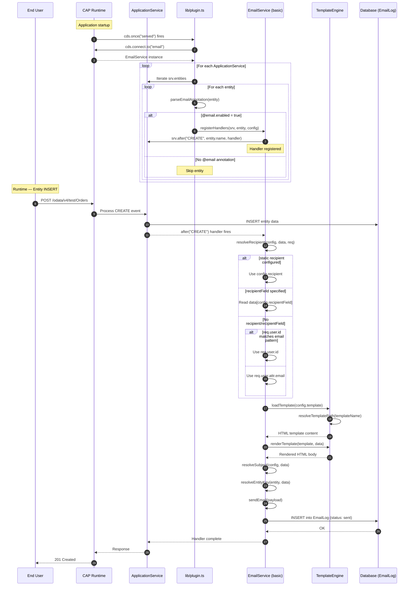
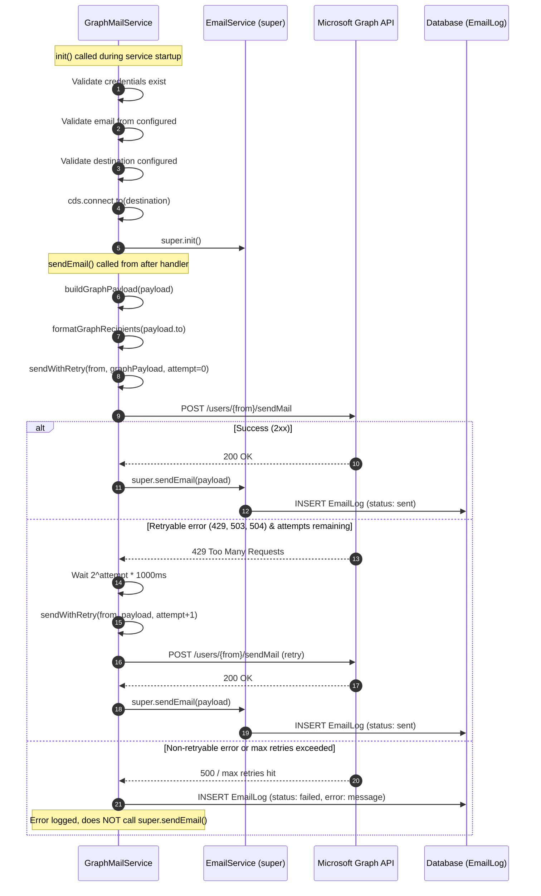
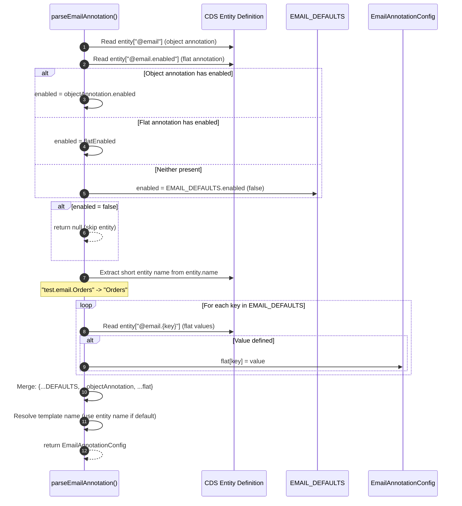
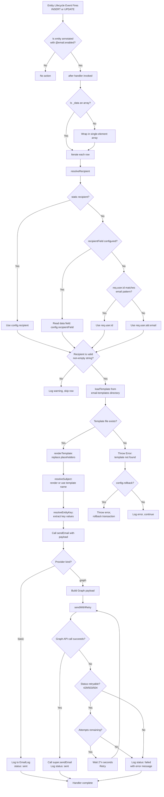
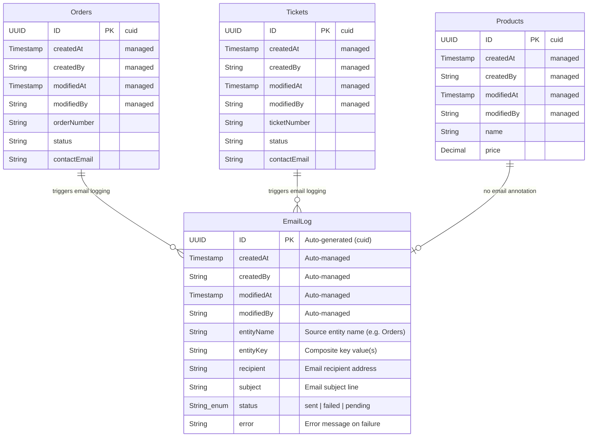
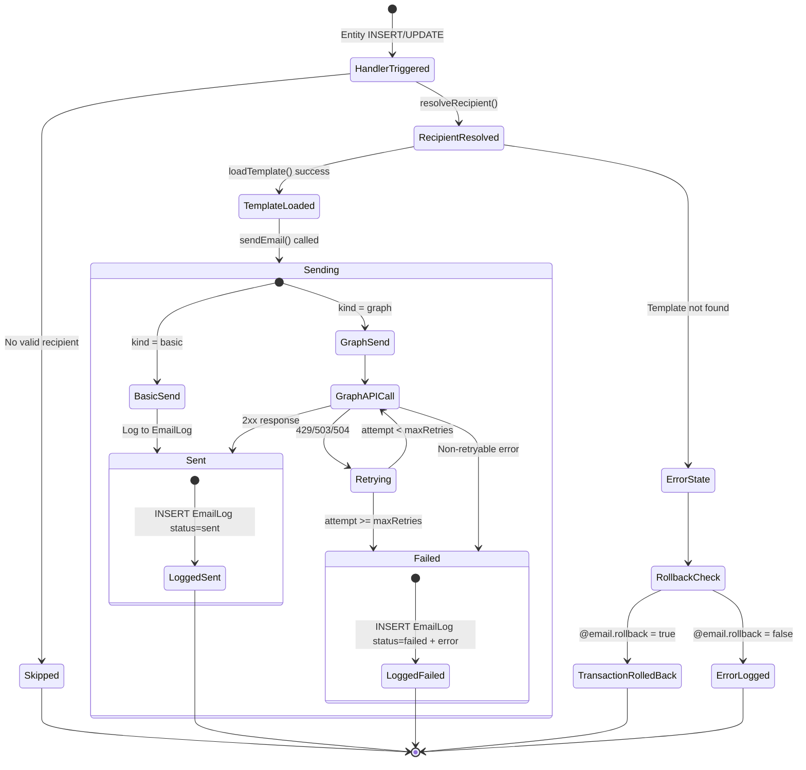
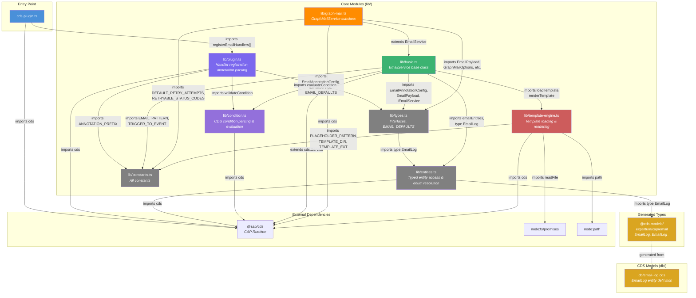

# cap-email Plugin - Technical Diagrams

## 1. C4 Context Diagram

## 2. C4 Container Diagram

## 3. Detailed Class Diagram (UML)

## 4. Core Sequence Diagram: Entity INSERT Triggering Email (Basic Provider)

## 5. Core Sequence Diagram: Graph Mail Provider with Retry

## 6. Core Sequence Diagram: Annotation Parsing Flow

## 7. System Flowchart: Email Dispatch Engine

## 8. Entity Relationship Diagram (ERD)

## 9. State Transition Diagram: Email Status Lifecycle

## 10. Module/Package Dependency Graph

