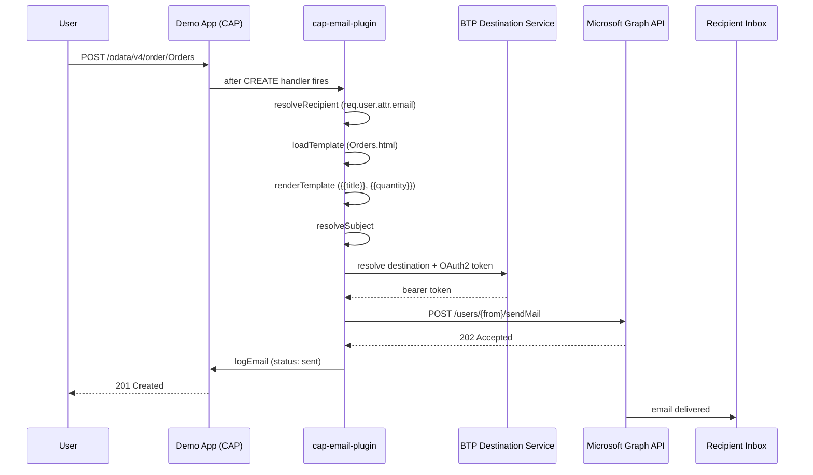

# Graph Demo App

Local demo application for end-to-end testing of the `@expertum/cap-email-plugin` with Microsoft Graph API via a BTP
destination. Lives at `test/graph-demo-app/`.

## Overview

The demo app is a minimal CAP bookshop (Books, Authors, Orders) with `@email` annotations on the Orders entity. Creating
an order triggers the full email dispatch flow through the GraphMailService, sending a real email via the Microsoft
Graph API.



## Architecture

The demo app uses **npm workspaces** to share a single `@sap/cds` instance with the plugin. This avoids the dual-loading
error that occurs when the plugin (symlinked via `file:../../.`) and the demo app each resolve their own copy.

```
repo root (workspace root)
├── package.json          ← workspaces: ["test/graph-demo-app"]
├── node_modules/
│   ├── @sap/cds          ← single shared instance
│   ├── @cap-js/sqlite
│   └── @expertum/cap-email-plugin → ../../.  (symlink)
└── test/graph-demo-app/
    ├── package.json      ← dependencies hoisted to root
    ├── .cdsrc-private.json  ← BTP credentials (cds bind, gitignored)
    ├── db/schema.cds     ← bookshop + @email annotations
    ├── srv/services.cds
    └── email-templates/Orders.html
```

### Key dependencies

| Package                      | Purpose                                        |
| ---------------------------- | ---------------------------------------------- |
| `@sap/cds`                   | CAP runtime                                    |
| `@expertum/cap-email-plugin` | The plugin under test (workspace symlink)      |
| `@cap-js/sqlite`             | In-memory SQLite for local development         |
| `@sap-cloud-sdk/resilience`  | Required by CAP for BTP destination resolution |
| `@sap-cloud-sdk/http-client` | Required by CAP for BTP destination resolution |

## BTP Destination Setup

The BTP destination must be configured as **OAuth2ClientCredentials** pointing to Microsoft Graph:

| Property       | Value                                                          |
| -------------- | -------------------------------------------------------------- |
| URL            | `https://graph.microsoft.com`                                  |
| Authentication | OAuth2ClientCredentials                                        |
| Token URL      | `https://login.microsoftonline.com/{tenant}/oauth2/v2.0/token` |
| Client ID      | Azure AD app registration client ID                            |
| Client Secret  | Azure AD app registration secret                               |
| Scope          | `https://graph.microsoft.com/.default`                         |

The Azure AD app registration needs the **Mail.Send** application permission (admin-consented).

## Running

```sh
# From repo root
npm install

# Configure (see test/graph-demo-app/README.md for details)
cd test/graph-demo-app
cds bind -2 <destination-service-instance>

# Run with hybrid profile to activate BTP bindings
npx cds-tsx watch --profile hybrid
```

## Known Issues

- **TypeScript errors after workspace install**: The `@cap-js/cds-types` postinstall symlink may not run during
  workspace install. Fix: `INIT_CWD=$(pwd) node node_modules/@cap-js/cds-types/scripts/postinstall.js`
- **`npm start` fails with `tsx not found`**: Use `npx cds-tsx watch` instead — `tsx` is in the root
  `node_modules/.bin`, not in the system PATH.
