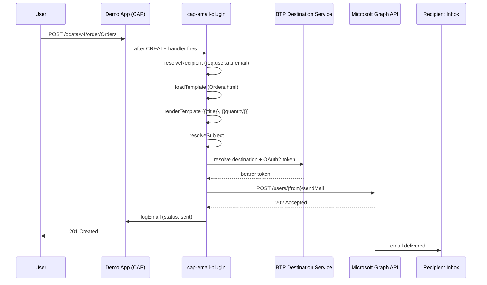

# Graph Email Demo App

Local demo app for end-to-end testing of the `@expertum/cap-email-plugin` with Microsoft Graph API via a BTP
destination. Lives at `test/graph-demo-app/`.

## Overview

The demo app is a minimal CAP bookshop (Books, Authors, Orders) with `@email` annotations on the Orders entity. Creating
an order triggers the full email dispatch flow through the GraphMailService, sending a real email via the Microsoft
Graph API.



## Architecture

The demo app uses **npm workspaces** to share a single `@sap/cds` instance with the plugin. This avoids the dual-loading
error that occurs when the plugin (symlinked via `file:../../.`) and the demo app each resolve their own copy.

```
repo root (workspace root)
├── package.json          ← workspaces: ["test/graph-demo-app"]
├── node_modules/
│   ├── @sap/cds          ← single shared instance
│   ├── @cap-js/sqlite
│   └── @expertum/cap-email-plugin → ../../.  (symlink)
└── test/graph-demo-app/
    ├── package.json      ← dependencies hoisted to root
    ├── .cdsrc-private.json  ← BTP credentials (cds bind, gitignored)
    ├── db/schema.cds     ← bookshop + @email annotations
    ├── srv/services.cds
    └── email-templates/Orders.html
```

### Key dependencies

| Package                      | Purpose                                        |
| ---------------------------- | ---------------------------------------------- |
| `@sap/cds`                   | CAP runtime                                    |
| `@expertum/cap-email-plugin` | The plugin under test (workspace symlink)      |
| `@cap-js/sqlite`             | In-memory SQLite for local development         |
| `@sap-cloud-sdk/resilience`  | Required by CAP for BTP destination resolution |
| `@sap-cloud-sdk/http-client` | Required by CAP for BTP destination resolution |

## Prerequisites

- BTP subaccount with a Destination Service instance
- BTP destination (OAuth2ClientCredentials) pointing to `https://graph.microsoft.com`
  - Scope: `https://graph.microsoft.com/.default`
- Microsoft 365 sender mailbox with `Mail.Send` application permission
- Cloud Foundry CLI logged in (`cf login`)

## BTP Destination Setup

The BTP destination must be configured as **OAuth2ClientCredentials** pointing to Microsoft Graph:

| Property       | Value                                                          |
| -------------- | -------------------------------------------------------------- |
| URL            | `https://graph.microsoft.com`                                  |
| Authentication | OAuth2ClientCredentials                                        |
| Token URL      | `https://login.microsoftonline.com/{tenant}/oauth2/v2.0/token` |
| Client ID      | Azure AD app registration client ID                            |
| Client Secret  | Azure AD app registration secret                               |
| Scope          | `https://graph.microsoft.com/.default`                         |

The Azure AD app registration needs the **Mail.Send** application permission (admin-consented).

## Setup

1. Install dependencies (run from repo root — uses npm workspaces):

   ```sh
   npm install
   ```

2. Update `test/graph-demo-app/package.json`:
   - Set `cds.requires.email.email.from` to your M365 sender address
   - Set `cds.requires.microsoft-graph.credentials.destination` to your BTP destination name
   - Set `cds.requires.auth.[development].users.alice.attr.email` to your recipient address

3. Bind to your BTP Destination Service instance:

   ```sh
   cd test/graph-demo-app
   cds bind -2 <YOUR_DESTINATION_SERVICE_INSTANCE>
   ```

## Run

```sh
cd test/graph-demo-app
npx cds-tsx watch --profile hybrid
```

Then create an order:

```sh
curl -X POST http://localhost:4004/odata/v4/order/Orders \
  -H "Content-Type: application/json" \
  -u alice: \
  -d '{"title": "Wuthering Heights", "quantity": 2, "book_ID": 201}'
```

Check your inbox for the order confirmation email.

## What happens

1. `POST /odata/v4/order/Orders` triggers entity INSERT
2. Plugin detects `@email.enabled: true` on Orders entity
3. `email-templates/Orders.html` is loaded and rendered with order data
4. Subject line `Order Confirmation: {{title}} (x{{quantity}})` is rendered
5. Email is dispatched via GraphMailService → BTP Destination Service → Microsoft Graph API
6. Result logged to `EmailLog` (visible in the SQLite DB)

## Troubleshooting

| Error                                                  | Fix                                                                                                                                                                 |
| ------------------------------------------------------ | ------------------------------------------------------------------------------------------------------------------------------------------------------------------- |
| `Could not find service binding of type 'destination'` | Run with `--profile hybrid` to activate `cds bind` credentials                                                                                                      |
| `The required field 'scope' is missing`                | Add scope `https://graph.microsoft.com/.default` to BTP destination                                                                                                 |
| `client secret keys are expired`                       | Rotate the secret in Azure Portal for the app registration                                                                                                          |
| `@sap/cds was loaded from different locations`         | Run `npm install` from the repo root (workspaces hoist deps)                                                                                                        |
| TypeScript errors after workspace install              | Run `INIT_CWD=$(pwd) node node_modules/@cap-js/cds-types/scripts/postinstall.js` — the `@cap-js/cds-types` postinstall symlink may not run during workspace install |
| `npm start` fails with `tsx not found`                 | Use `npx cds-tsx watch` — `tsx` is in root `node_modules/.bin`, not in the system PATH                                                                              |
